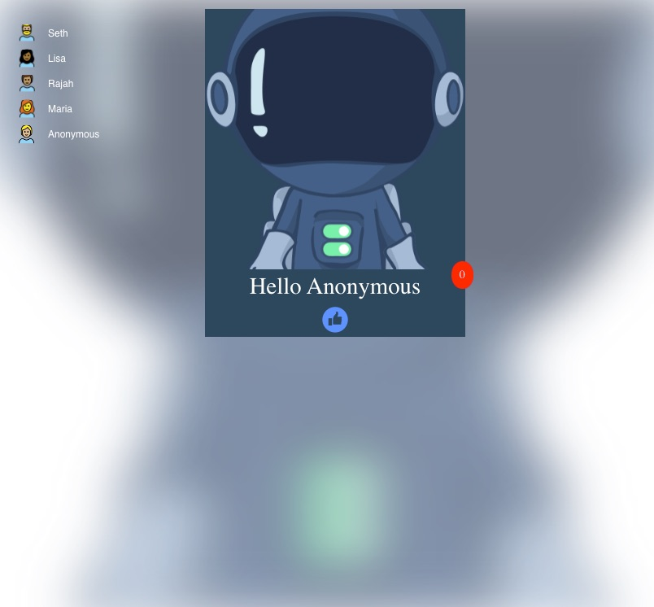

# Sample JS Client SDK Demo App

Sample Web application using LD JS Client SDK.
This project includes:
- LaunchDarkly JS client-side SDK sample implementation
- Terraform configuration for setting up the project for this demo
- Code reference sample script and configuration 


## Files

```
.
├── LICENSE
├── css
│   └── main.css
├── images
│   ├── Demo_JS_Application.jpg
│   ├── ThumbsUpDark.png
│   ├── ThumbsUpLight.png
│   ├── Toggle_Halloween_Dark.png
│   ├── jtoggle-hero.png
│   ├── likebutton.png
│   └── people.png
├── index.html
├── js
│   ├── ld_js_wrapper.js
│   └── pageutil.js
├── ldCodeRef.sh
├── terraform
│   ├── modules
│   │   └── launchdarkly
│   │       ├── main.tf
│   │       ├── outputs.tf
│   │       └── variables.tf
│   └── development
│       ├── main.tf
│       ├── variables.tf
│       └── terraform.tfvars
├── README.md
└── coderefs
    └── sample-config
        ├── sample1.yml
        └── sample2.yml

```


## Setup
1. Create an access token for creating your LaunchDarkly project using Terraform, read [API Access Token](https://docs.launchdarkly.com/home/account-security/api-access-tokens) for details. Copy the access token and update the ./terraform/development/terraform.tfvars.

```
access_token="<Access Token for Terraform>"

```

2. Create LaunchDarkly project and copy the client-side ID by following the steps in section **Provisioning LaunchDarkly Project** below.

3. Edit the index.html, and paste your client-side id
```
const config = {
                clientId:'<LD Client-side ID>',
                project:'sample-js-demo',
                environment:'development',
                debug:true,
                createUser

            };
```
4. Open your browser and type `<local path>/index.html` in your browser.


## Provisioning LaunchDarkly Project with Terraform

Pre-requisite: Install Terraform and generate LaunchDarkly access token, read [API Access Token](https://docs.launchdarkly.com/home/account-security/api-access-tokens).

1. Change directory to ./terraform/development folder. Open a terminal and run the command **terraform plan** to verify the configuration

` $> terrafrom plan`

2. Run Terrafrom apply

```
 $> terrafrom apply

OR
 
 $> terraform apply -auto-approve` // automatically applies changes without prompt

```
3. Generate the .webconfig.js file by running this script
```
$> ./creatwebconfig.sh
```


## Creating Code References
Read [this](https://docs.launchdarkly.com/home/code/code-references#prerequisites) document for installation and pre-requisites.
1. Log in to your LaunchDarkly account, create and copy the API access token (see pre-requisite).
2. Update the ldCodeRef.sh file with your access token

```
TOKEN="<API Access token>"
PROJECT="sample-js-demo"
REPO_NAME="sample-js-demo" // OR YOUR REPO NAME

```

3. Run the script. 

```
$> ./ldCodeRef.sh
```
# Resources
* [ld-find-code-refs options](https://github.com/launchdarkly/ld-find-code-refs/blob/master/docs/CONFIGURATION.md#command-line)
* [ld-find-code-res Arguments](https://github.com/launchdarkly/ld-find-code-refs/blob/master/docs/CONFIGURATION.md#required-arguments)
* [LaunchDarkly Terraform Provider](https://registry.terraform.io/providers/launchdarkly/launchdarkly/latest/docs)
* [LaunchDarkly Terraform GIT REPO](https://github.com/launchdarkly/terraform-provider-launchdarkly)
* [Terraform Language Doc](https://www.terraform.io/docs/language/index.html)