# Table of Contents
1. [Introduction](#introduction)
1. [Using Feature Flags](#using)
1. [How LaunchDarkly works](#how)
1. [Flag Prerequisites](#flag)
1. [Targeting](#targeting)

# Resources
- [LaunchDarkly blog](https://blog.launchdarkly.com/)
- [LaunchDarkly platform documentation](https://docs.launchdarkly.com/home)
- [LaunchDarkly SDK documentation](https://docs.launchdarkly.com/sdk)
- [LaunchDarkly integrations documentation](https://docs.launchdarkly.com/integrations)

# Introduction to Feature Flags
A feature flag is a software development technique used to enable or disable functionality remotely without changing code. It is a decision point in code with varying behavior based on external input.

Feature flags help separate deployment from release, which lets you manage the full lifecycle of a feature.


[](https://fast.wistia.net/embed/iframe/g3ifgwu7q0)

Eliminate risk and deliver value
LaunchDarkly enables development and operations teams to deploy code at any time, even if a feature isn't ready to be released to users. Wrapping code with feature flags gives you the safety to test new features and infrastructure in your production environment without impacting end users.

When you are ready to release, update the flag status, and the changes are made instantaneously by our real-time streaming architecture.

Let's begin by looking at the game you're going to change and then release with feature flags.

## Configuring the SDK
1. Login to your LaunchDarkly account.
1. Copy the `Client-side id` by clicking the Client-side ID key in **Account settings > Projects > Workshop**
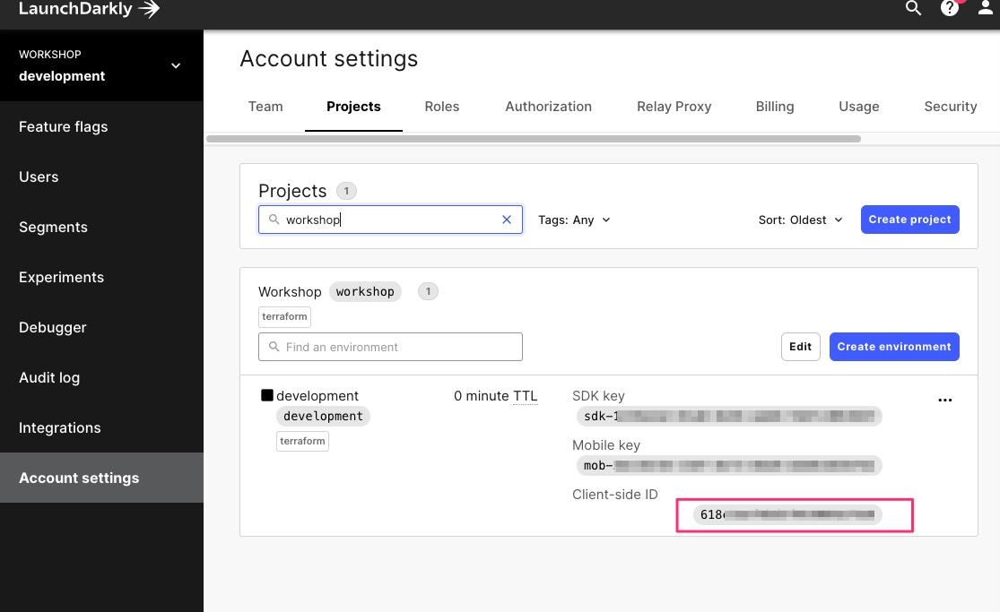
1. Open the `index.html` file
1. Paste the `Client-side id` in the **clientId** property.

```
    const config = {
                clientId:'<YOUR Client-side ID>',
                project:'sample-js-demo',
                environment:'development',
                debug:false,
                createUser

            };
```
Open a browser and type the full path to the `index.html` file.
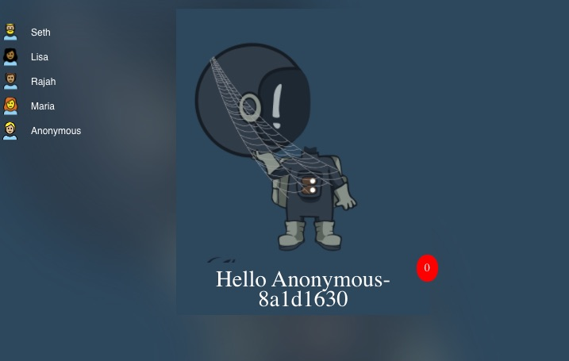

# Using Feature Flags
## Enable Dark Mode
1. Open a new tab and Log in to to your LaunchDarkly. Make sure you are in your project and environment `Workshop > Development`.
1. Click `Feature Flags` in the left panel.
1. Toggle `Dark Mode` to **ON**. Add comment and click `Save Changes`.
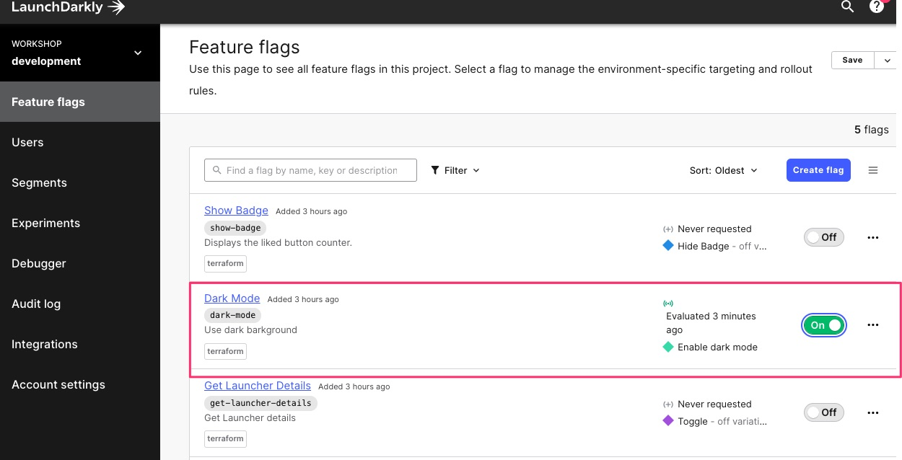 
You should see dark theme applied to your page.
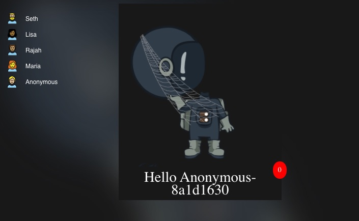 

### How LaunchDarkly works
LaunchDarkly uses a real-time streaming connection which ensures we can deliver lightning-fast feature management services for enterprises of any size.
#### LaunchDarkly architecture
Our streaming technology provides a consistent connection to your SDKs allowing you to instantly turn features on or off at a significantly lower cost than polling. A global CDN ensures the lowest latency without remote requests
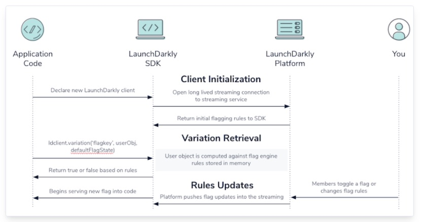 

LaunchDarkly uses server-sent events (SSE), a protocol for one-way real-time messaging, to send messages to your servers whenever you change feature flag rules on your dashboard. The SSE connection is handled automatically by our SDKs. No more waiting and wondering if the changes you requested have actually propagated across all your servers.

#### SDK Variation call
The LaunchDarkly SDK function that evaluates a flag is *ldclient.variation()/ ldclient.variationDetail()*.

*./js/pageutils.js*
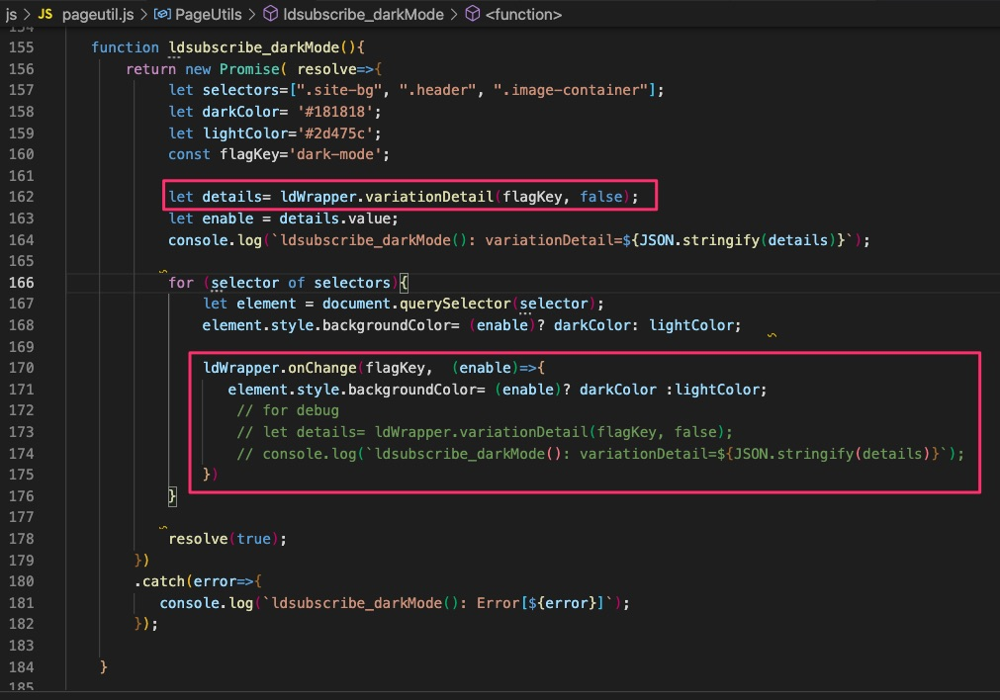
# Flag Prerequisites
Prerequisites allow you to control feature dependencies in LaunchDarkly. You can make flags depend on other flags being enabled to take effect themselves, making them prerequisites to enable a feature.

## Creating Flag Prerequisite
Create a flag dependency between the badge and like button component.
1. Open a new tab and Log in to to your LaunchDarkly. Make sure you are in your project and environment `Workshop > Development`.
1. Click `Feature Flags` in the left panel.
1. Click  `Show Badge`.
1. Click `+ Add prerequisites`. 
1. Select `Show Like Button` in the **Select a flag** dropdown. 
1. Select `true` in the **Select a variation** dropdown. 
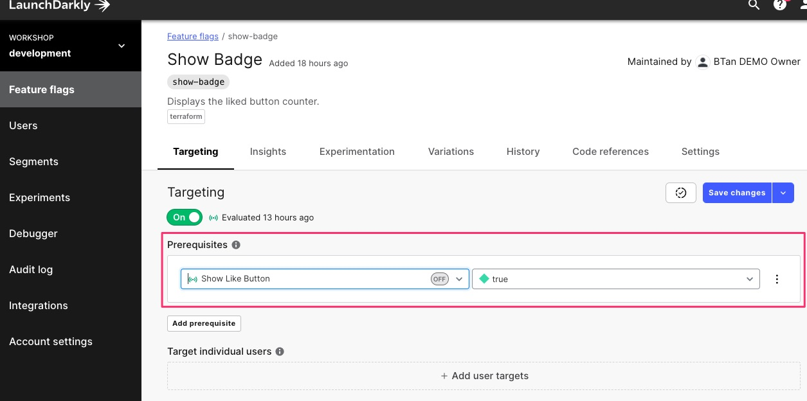 
1. Select `Save changes`.
The badge component should be hidden from the page
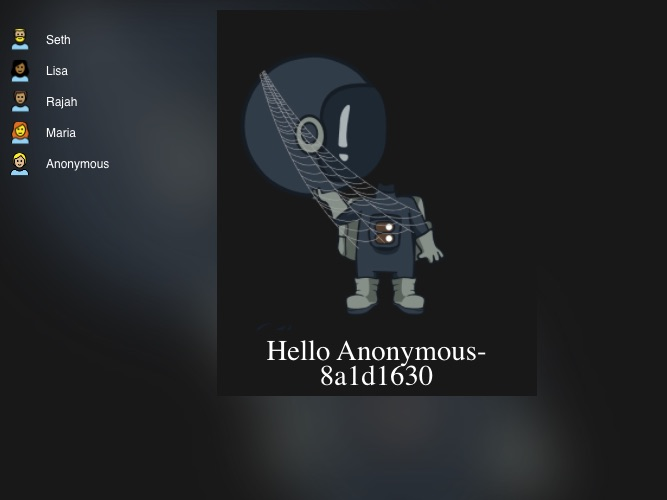 
1. Click `Feature Flags` in the left panel.
1. Toggle `Show Like Button` to **ON** and **Save Changes**
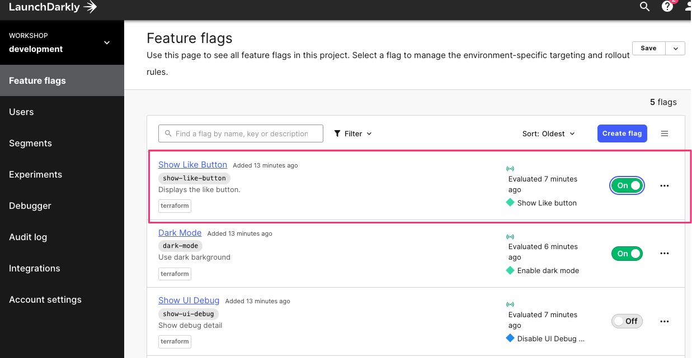 
You should see both the Like button and Badge component appear on the page.
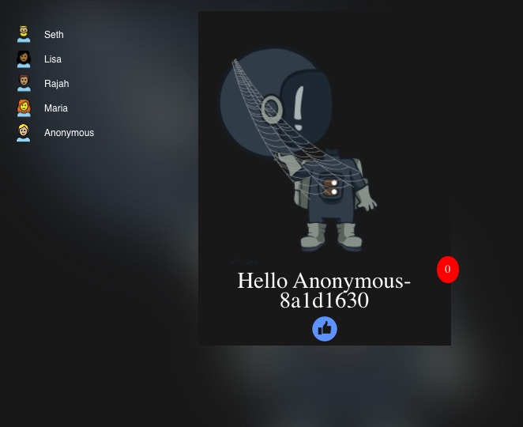 

# Targeting
LaunchDarkly uses the term targeting to describe configuring a flag so that it evaluates differently depending on its context. This is useful when the flag is controlling code that should be run only in specific conditions.
Here are some example uses for targeting:

- Show a website feature only when the visitor is using a specific browser
- Provide a user the option to upgrade their account when you know that their account is eligible
- Show the user a different greeting depending on the time of day in their timezone
- To set up targeting in a flag, you need to provide context in the code, and rules in the flag configuration. Let's look at each of those in more depth.
## Understanding User Context
Context objects contain attributes, each of which has a name and a value. In this code snippet, the context only contains one attribute named key. The key is the standard attribute that LaunchDarkly uses as an ID for a context, so in this case, this context has the ID user123.
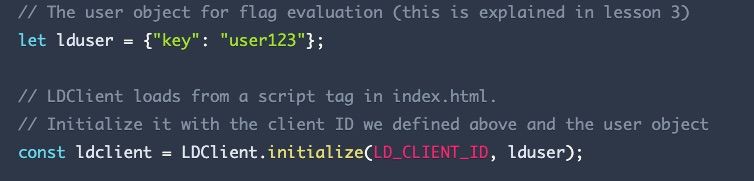

LaunchDarkly lets you add add as many custom attributes as you like, and then use those attributes for your targeting rules. Attribute values can be either single strings (such as hello there) or lists of strings (such as ["this", "list", "right", "here"]).


## Targeting  Users with flags
Targeting rules allow you to enable or disable feature for the users you specify in the feature flag.
### Disable Dark Mode for Lisa
1. Open a browser to the `index.html` file and click `Lisa` from the left navigation.
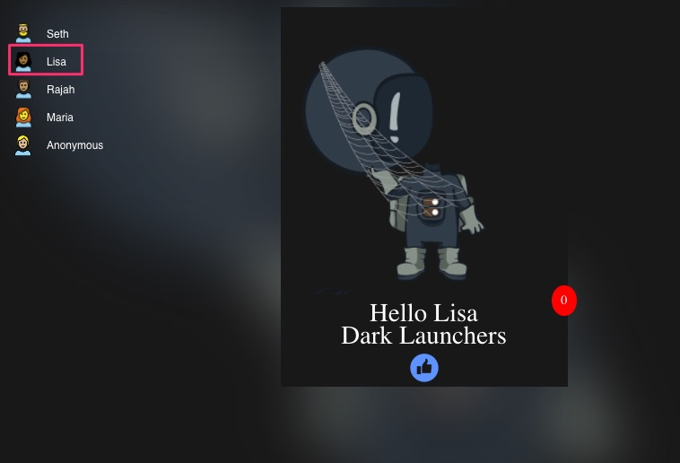
1. Open a new tab and Log in to to your LaunchDarkly. Make sure you are in your project and environment `Workshop > Development`.
1. Click `Feature Flags` in the left panel.
1. Click `Dark Mode`.
1. Click `+ Add User targets` and select **Lisa** from the **Add users** drop down.
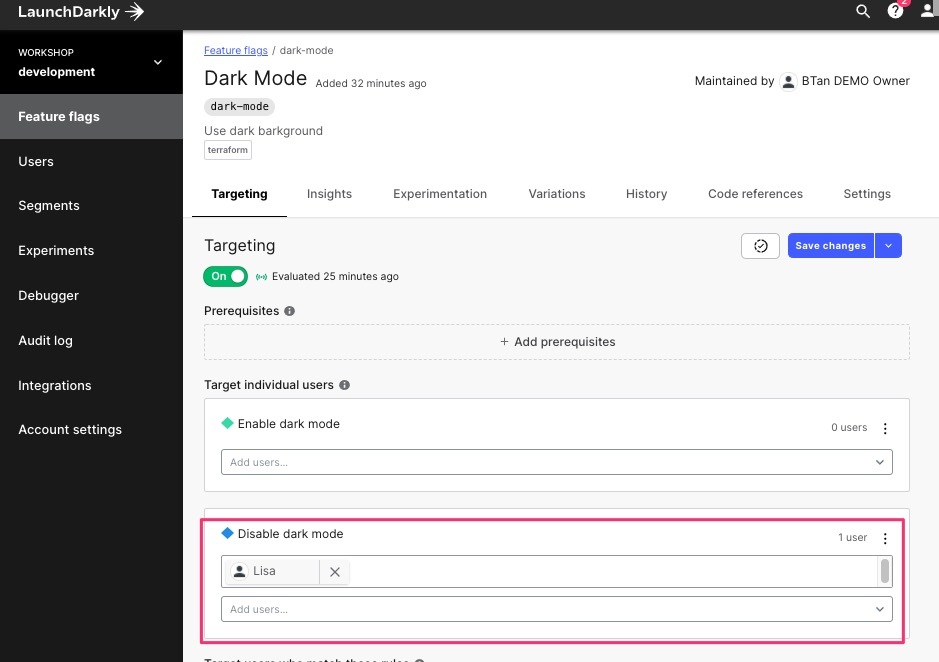
1. Click `Save changes`
The them **Dark Mode** will no longer be applied when the user **Lisa** is selected.
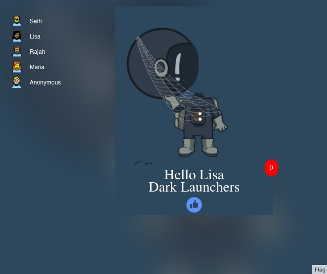

## Targeting with Rules
 Rules offer more complex ways to match arbitrary user attributes and segments, and to execute controlled rollouts based on those criteria.
### Show Light and Dark Toggle based on group
1. Open a browser to the `index.html` file and click `Lisa` from the left navigation.

1. Open a new tab and Log in to to your LaunchDarkly. Make sure you are in your project and environment `Workshop > Development`.
1. Click `Feature Flags` in the left panel.
1. Click `Get Launcher Details`.
1. Click `+ Add rules`.
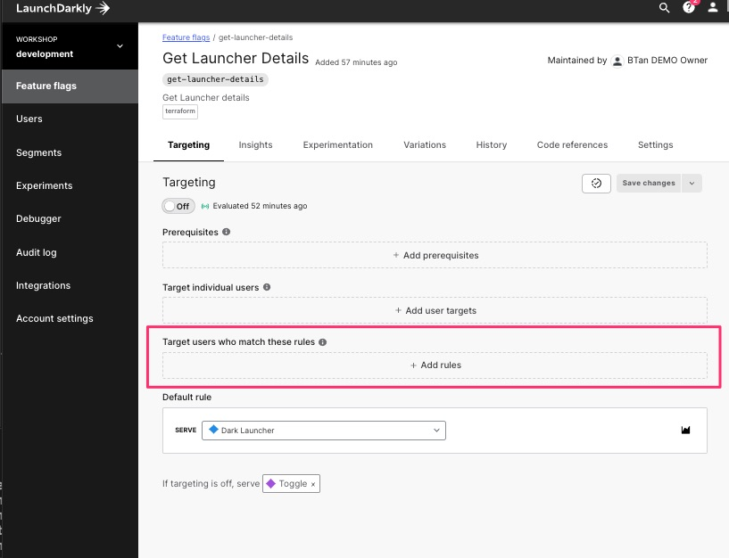
1. Enter `Light Launcher` in the **Rule 1** text field.
1. Select `group` in the **Select an attribute** dropdown.
1. Select `contains` in the **Select an operator** dropdown.
1. Select `Light Launchers` in the **Enter some values** dropdown.
1. Select `Light Launcher` in the **Select variation** dropdown.
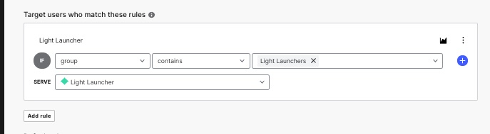
1. Click `Add rule` button
1. Enter `Light Launcher` in the **Rule 1** text field.
1. Select `group` in the **Select an attribute** dropdown.
1. Select `contains` in the **Select an operator** dropdown.
1. Select `Dark Launchers` in the **Enter some values** dropdown.
1. Select `Dark Launcher` in the **Select variation** dropdown.
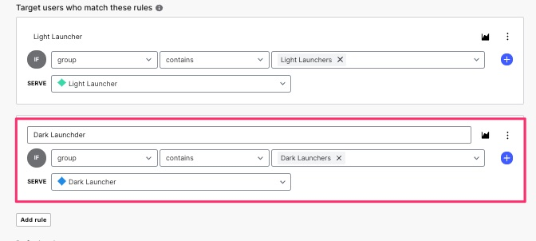
1. Select `Toggle` in the **Default rule** drop down.
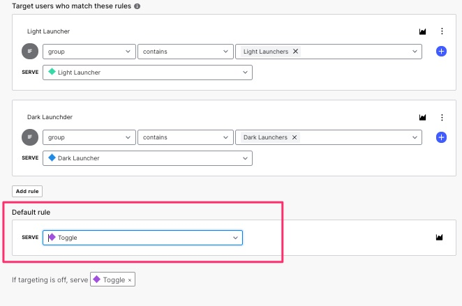
1. Toggle `Targeting` to **ON** and Click **Save**.

Check your configuration with the sample below
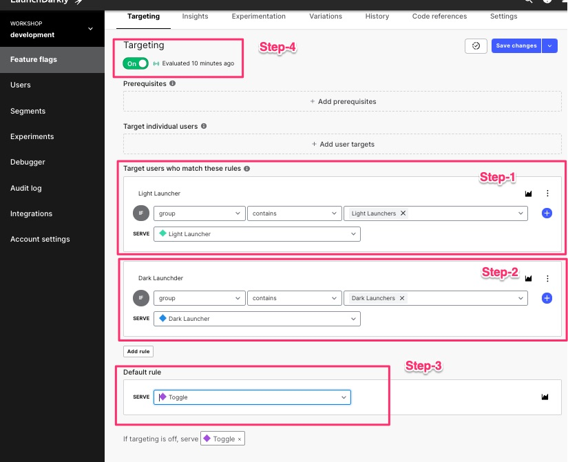

Open your browser and load `index.html` click each user on the left navigation.
Users that belongs to **Light Launchers** group will be presented with *Light Toggle* and **Dark Launchers** are presented with *Dark Toggle*.

**Light Launcher**

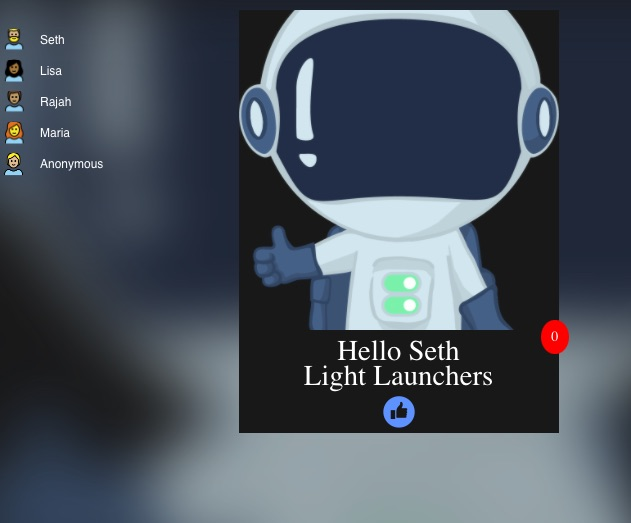

**Dark Launcher**

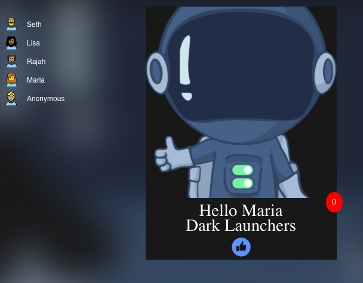

**Anonymous/No Groups Launcher**

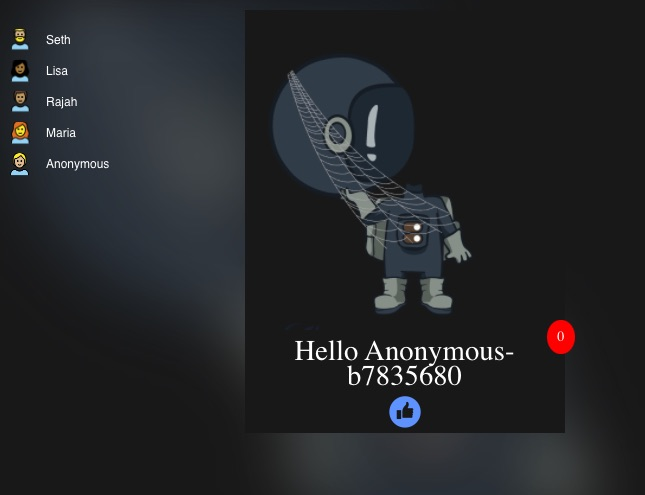